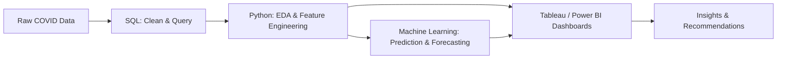

# COVID-19 Global Analytics: SQL, Python & Machine Learning Portfolio

**End-to-end data analytics project** from raw SQL queries through Python-based exploratory analysis and machine learning, to interactive Tableau and Power BI dashboards. Built to demonstrate the full data lifecycle: extract → clean → analyze → model → visualize.

---

## Project Overview

This project explores global COVID-19 case, death, testing, hospitalization, and vaccination data to answer real public-health questions: which countries and demographics were hit hardest, how health systems responded under strain, whether vaccination measurably reduced deaths, and new in this phase **what factors best predict a country's COVID outcomes, and how case trends can be forecast forward using machine learning.**

The project is split into three layers that build on each other:

1. **SQL layer** — data querying, cleaning logic, and aggregation 
2. **Python/ML layer** — exploratory data analysis, feature engineering, and predictive modeling
3. **Visualization layer** — interactive Tableau and Power BI dashboards for non-technical stakeholders

## Tech Stack

**Data Storage & Querying**
- SQL Server Management Studio (SSMS 22), MySQL
- T-SQL: joins, CTEs, window functions, views, temp tables

**Data Analysis & Machine Learning (Python)**
- `pandas`, `numpy` — data cleaning, feature engineering
- `matplotlib`, `seaborn`, `plotly` — exploratory visualization
- `scikit-learn` — regression, classification, clustering
- `statsmodels` / `prophet` — time-series forecasting
- Jupyter Notebook — analysis documentation

**Business Intelligence**
- Tableau (Public/Desktop) — interactive dashboards, maps, Stories
- Power BI — DAX measures, star-schema data model, AI visuals (Key Influencers, Decomposition Tree)

**Version Control**
- Git & GitHub

---

## Project Workflow



---

## SQL Skills Demonstrated

- `SELECT` statements, `WHERE` filtering, `GROUP BY`, `ORDER BY`
- `JOIN`s across 5 normalized tables (Deaths, Location, Vaccination, Testing, Hospitalizations)
- Common Table Expressions (CTEs)
- Window functions (`ROW_NUMBER() OVER (PARTITION BY ... ORDER BY ...)`)
- Aggregate functions (`SUM`, `MAX`, `AVG`, `ROUND`)
- Views and temporary tables for reusable logic
- 29+ business questions translated into production-ready queries

---

## Python & Machine Learning Skills Demonstrated

**Exploratory Data Analysis**
- Missing-data handling and outlier detection across 5 joined tables
- Feature engineering: fatality rate, vaccination rate, tests-per-case, population-adjusted metrics
- Correlation analysis between socioeconomic factors (GDP, median age, population density, diabetes prevalence) and health outcomes

**Machine Learning Models** 
- **Regression** — predicting case-fatality rate from country-level features (population density, median age, GDP per capita, healthcare access indicators)
- **Classification** — labeling countries as high/low-risk based on outcome thresholds; evaluated with accuracy, precision/recall, and a confusion matrix
- **Clustering (K-Means)** — grouping countries into outcome "profiles" (e.g., high-testing/low-fatality vs. low-testing/high-fatality) for an unsupervised view the dashboards can't show
- **Time-series forecasting** — projecting future case/death trends using ARIMA or Prophet, validated against held-out actual data

**Model Evaluation**
- Train/test split methodology, cross-validation
- Metrics reported per model: R², RMSE (regression); accuracy, F1-score (classification); forecast error (MAPE/RMSE for time series)

---

## Dashboards

**Tableau** (https://public.tableau.com/views/CovidAnalysisbycountry/CovidAnalysisbycountry?:language=en-US&:sid=&:redirect=auth&:display_count=n&:origin=viz_share_link)
- Africa & South Africa Spotlight (filled map, wave timeline, hospital strain, policy response)
- Global case/death/vaccination trend dashboards

**Power BI** 
- Star-schema data model (DimCountry, DimDate, 4 fact tables)
- 20-question analytical report spanning cases, deaths, vaccination, testing, hospitalization
- AI visuals: Key Influencers and Decomposition Tree for outcome-driver analysis

Visualized throughout:
- Total cases, total deaths, death/fatality rate
- Vaccination rollout and booster progress
- Country and continent comparisons
- Testing efficiency and positivity rates
- Hospital and ICU pressure
- **ML-driven**: predicted vs. actual case trends, feature importance rankings, risk-tier classification

---

## Repository Structure

```
covid19-analytics-portfolio/
│
├── sql/
│   └── covid_queries.sql              # 29+ cleaned, reusable SQL queries
│
├── python/
│   ├── 01_data_cleaning.ipynb         # EDA, missing data, feature engineering
│   ├── 02_regression_model.ipynb      # fatality rate prediction
│   ├── 03_classification_model.ipynb  # high/low risk classification
│   ├── 04_clustering.ipynb            # country outcome profiles
│   ├── 05_forecasting.ipynb           # case/death time-series forecasting
│   └── requirements.txt
│
├── tableau/
│   ├── covid19_analytics_suite.twbx
│   └── screenshots/
│
├── powerbi/
│   ├── covid19_report.pbix
│   └── screenshots/
│
├── data/
│   └── (raw and cleaned datasets, or a note on data source if too large for GitHub)
│
└── README.md
```


## Dataset

Worldwide COVID-19 case, death, testing, hospitalization, and vaccination data, sourced from : https://ourworldindata.org/covid-deaths. Five normalized tables: `CovidDeaths`, `Vaccination`, `Location`, `Testing`, `Hospitalizations`, joined on `code` and `date`.

## Key Findings

The analysis produced several notable findings across COVID-19 burden, policy response, vaccination, healthcare pressure, testing, and socioeconomic factors:

1. **Burden — 103.4M reported cases:** The United States recorded the highest cumulative number of reported COVID-19 cases in the dataset, followed by China (**99.4M**) and India (**45.1M**).

2. **Policy — 0–28 day lag analysis:** The analysis tested relationships between government stringency and subsequent case growth using 0-, 7-, 14-, 21-, and 28-day lags. The results highlight the importance of considering delayed effects when evaluating policy and case trends rather than comparing policy changes with cases on the same day.

3. **Vaccination — 134 of 239 countries reached 50% full vaccination:** Among countries reaching the milestone, the median time from the first reported vaccination to 50% full vaccination was **232 days**. Mean case-fatality rate declined from **1.77% to 1.34%** after countries reached 30% full vaccination, and from **1.39% to 0.99%** after reaching 50%.

4. **Hospitals — 12-day median hospitalization-to-death lag:** Across countries with sufficient hospitalization data, the strongest relationship between hospital admissions and subsequent deaths occurred at a median lag of **12 days**. Hospital admissions per 100 weekly cases also varied across pandemic eras, with median values of **8.62** during the Original/Alpha period, **4.35** during Delta, and **5.20** during Omicron+.

5. **Testing — 54 of 135 countries averaged over 10% positivity:** High average positivity rates were observed in several countries, including Brazil (**46.87%**), Mexico (**30.47%**), and Ecuador (**28.40%**). High positivity can indicate that testing capacity was insufficient to capture the full extent of transmission.

6. **Socioeconomic drivers — r = 0.487:** GDP per capita showed a **moderate positive correlation** with vaccination coverage. Higher-income countries generally achieved higher vaccination coverage, although the relationship should be interpreted as an association rather than evidence that GDP directly caused higher vaccination rates.

### Additional Analytical Findings

* **Population density vs. reported cases:** The correlation was weak (**r = 0.159**), suggesting that population density alone did not explain differences in reported cases per 100,000 people.
* **Diabetes prevalence vs. reported CFR:** The relationship was very weak (**r = -0.083**), indicating that diabetes prevalence alone was not a strong linear predictor of country-level reported case-fatality rates in this analysis.
* **Hospitalization burden:** Comparing hospital admissions with estimated weekly cases provided a way to evaluate healthcare pressure relative to reported transmission rather than relying only on absolute hospitalization counts.
* **Vaccination and outcomes:** The before/after comparisons around 30% and 50% full-vaccination milestones showed lower mean CFR following the milestones, providing an important association for further investigation.


---

## Future Work

- [ ] Deploy the forecasting model as a simple API or Streamlit app for live predictions
- [ ] Expand classification model with additional features (healthcare spending, hospital beds per capita)
- [ ] Automate the SQL → Python → dashboard refresh pipeline

---

## Author

**Keith Ndebele**
https://github.com/keithndebele • www.linkedin.com/in/ndebelekeithk • https://keithkndebeleportfolio.lovable.app
